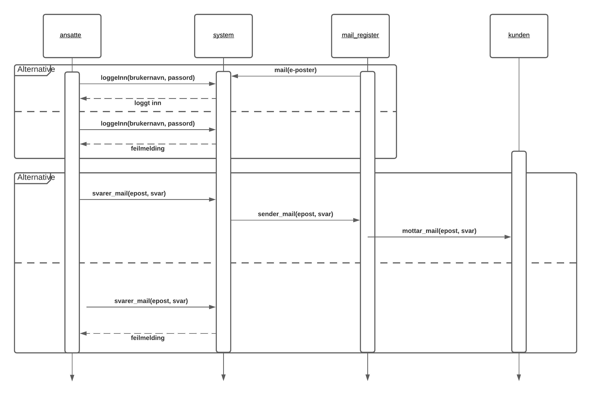

# Email_System

## Use Case

Use case som viser de fem hovedfunksjonaliteter som  vi kommer til å fokusere på 
Primæraktøren er ansatte som skal kunne utføre disse funksjonaliteten. 
Sekundær aktøren er email systemet som skal hjelpe ansatte med å utføre disse funksjonene
User story 
 
### User Stories

*Viser en tekstlig beskrivelse av funksjonalitetene som vi har laget i use case*

| User Stories |
| ---- |
|Som ansatt skal jeg kunne logg inn i systemet slik at kan bruke den|
|Som ansatt skal jeg kunne sortere mailen som ligger i systemet for å lettere finne riktig mail|
|Som ansatte skal jeg kunne svare tilbake kunden slik at kunden får svar på mailen han har sendt|
|Som ansatte skal jeg kunne arkivere mailen slik at jeg har den som dokumentasjon |
|Som ansatte skal jeg kunne endre teksten til PDF og sende tilbake til kunden på en fin tekstlig format|

## Sekvensdigram 
Sekvensdiagrammet viser systemets hoved- og alternative flyt. Objekt og actors vises på toppen av diagrammet. 
Fra disse ser vi piler som linker til hver objekt. 
 

### _Scenario fra diagram:_

 

### User Stories

| Punkt  | Hovedflyt | Alternativ flyt|
| ------------- | ------------- |-------------|
|1| mail sendes til systemet|   |
|2 | kunden logger inn | |
|3 | systemet verifiserer kunden| feil innlogging sendes til punkt 2 |
|4 | ansatte svarer på mail | |
| 5 | systemet sender mailen viderer | feil epost sendes til punkt 4 |
| 6 | kunden mottar  mailen | |
 

(2) Her har vi tatt fokus på sortering av epost, uavhengig hvordan det er ønsket å sortere.
Mail kommer fra mail_register og sendes videre til system. 
Systemet vil fungere som et mellomledd der mail vises fram. 
Dersom det ikke er mulig å sortere som ansatte har valgt, vil bruker få feilmelding og 
muligheten til å sortere andre måter. 
Dersom det er mulig å sortere på ønsket måte, vil mail sorteres og vises fram hos ansatte. 

