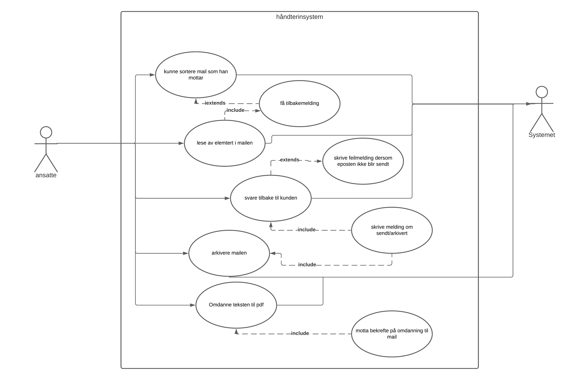
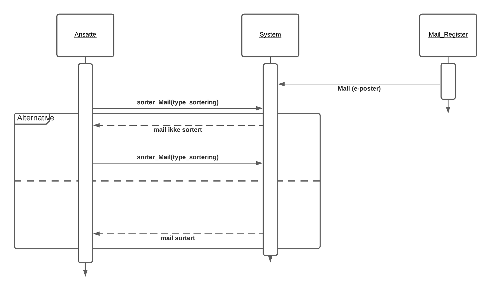

# Email_System

## Use Case

Use case som viser de fem hovedfunksjonaliteter som  vi kommer til å fokusere på 
Primæraktøren er ansatte som skal kunne utføre disse funksjonaliteten. 
Sekundær aktøren er email systemet som skal hjelpe ansatte med å utføre disse funksjonene
User story 
 
### User Stories
####*Viser en tekstlig beskrivelse av funksjonalitetene som vi har laget i use case*

| User Stories |
| ---- |
|Som ansatt skal jeg kunne sortere mailen som ligger i systemet for å lettere finne riktig mail|
|Som ansatte skal jeg kunne lese av spesifikke elementer i mailen som jeg skal bruke for å videre| 
|Som ansatte skal jeg kunne svare tilbake kunden slik at kunden får svar på mailen han har sendt|
|Som ansatte skal jeg kunne arkivere mailen slik at jeg har den som dokumentasjon |
|Som ansatte skal jeg kunne endre teksten til PDF og sende tilbake til kunden på en fin tekstlig format|

